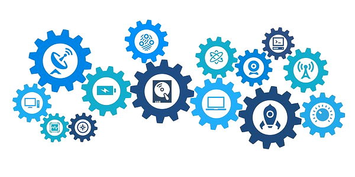

# Research Introduction

Besides learning how to create technology solutions, it's also important to understand the broader context of how computing impacts society.  For example:

* How do new developments in computing technology affect society?
* What are the social and ethical concerns with the use \(or misuse\) of technology?
* What career pathways are available in computing?

You’ll conduct research to learn more about certain topics in computing. Then you’ll share and discuss your research findings with other people.


**CHOOSING A TOPIC:**  Your teacher will identify which specific research topic\(s\) you should research, as well as the deadline for completing and presenting your research findings.


## Copyright and License 

Copyright © 2018 Michael Frontz and Jim Lyst, Indiana University School of Informatics and Computing at IUPUI

This material is part of the [Computing by Design](https://docs.idew.org/the-cxd-framework/) high school computer science curriculum developed for the [Informatics Diversity-Enhanced Workforce \(iDEW\)](http://soic.iupui.edu/idew/) program, an award-winning community partnership in central Indiana that is broadening student participation in computing and helping students develop the skills essential for success in the 21st century workplace.

This work is licensed under a [Creative Commons Attribution-NonCommercial-ShareAlike 4.0 International License](http://creativecommons.org/licenses/by-nc-sa/4.0/). You are free to use, share, or adapt this material for noncommercial purposes as long as you provide proper attribution and distribute any copies or adaptations under this same license.

​[​​](http://creativecommons.org/licenses/by-nc-sa/4.0/)​

